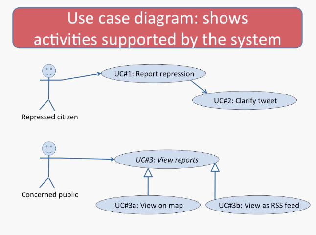

# Lecture 3.2 - Notations

### Building Anything Big Requires Communications
* Suppose you want to build something...
* Diagrams are often usefful when:
  * You need to communicate, visualize, or analyze something
  * And that something has some sort of structure

### Typical parts of requirements documentation
* Functional requirements
  * Unstructured text 
  * Use cases
* Non-functional requirements
  * Unstructured text (criteria)
* **Diagrams**
  * Class diagrams and entity-relationship diagrams
  * Dataflow, sequence, and state diagrams

# Use case diagram: shows activities supported by the system

