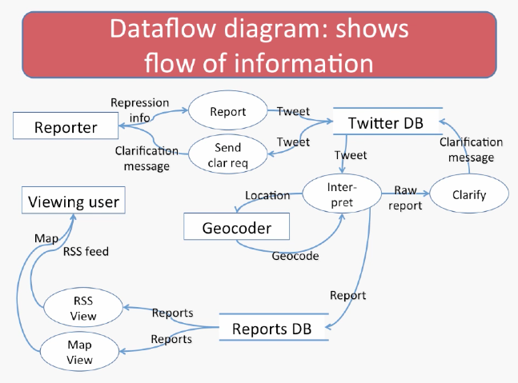

# Lecture 3.2 - Notations

## Building Anything Big Requires Communications
* Suppose you want to build something...
* Diagrams are often usefful when:
  * You need to communicate, visualize, or analyze something
  * And that something has some sort of structure

## Typical parts of requirements documentation
* Functional requirements
  * Unstructured text 
  * Use cases
* Non-functional requirements
  * Unstructured text (criteria)
* **Diagrams**
  * Class diagrams and entity-relationship diagrams
  * Dataflow, sequence, and state diagrams

## Use case diagram: shows activities supported by the system

## Notes on use case diagrams
* Stick man for user
* Ovals for use cases
  * Italicize "abstract" use cases
* Simple arrows when a UC "calls" another
* Hollow arrowheads for specialization
  * Similar to the role that subclassing plays in OO

## UML class diagram: shows entities, attributes, relationships

## Notes on UML class diagrams
* One box per kind of entity, listing attributes
  * Italicize abstract entities, attributes
* Lines without arrowheads show references
  * Similar to member variables in OO
  * Labeled with cardinality (multiplicity) - integers, ranges, or asterisk (for unlimited)
* Lines with hollow arrowheads for specialization 
* Lines with regular arrowheads can be used to indicate dependencies
  * Usually omitted in requirements' class diagrams

## Entity-relationship diagram: shows entities, attributes, relationships

## Notes on entity-relationship diagrams (ERDs)
* One box per kind of entity
* List entities on branches
* Lines with a diamond show relationships
  * Diamond label indicates role of relationship
* Numbers or variable on lines show cardinality

### Dataflow diagrm: shows flow of information
 
