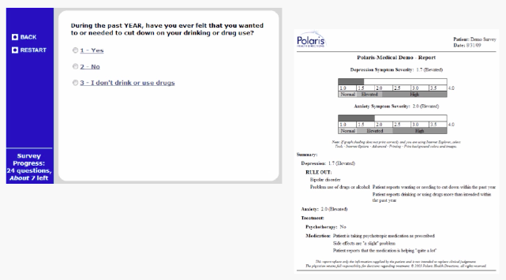
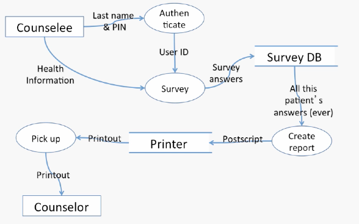
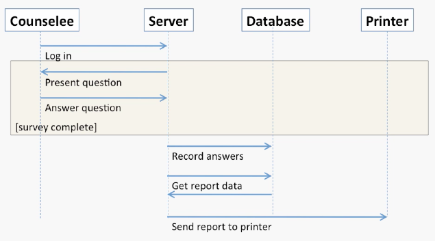

# Lecture 3.3 - Example Requirements

## An example system to support drug and alcohol counseling

## Functional Reqs, Unstructured Text
* Before each counseling visit, each counselee takes a suvey.
* After each survey, the system prints a report showing the counselee's progress
* Administrative assistants can add counselees and their counselors to the system

## Non-functional Req, with fit criteria
* Each survey will be short enough for an average user to complete in 10 minutes.
* Progress reports will each be 2 pages or less
* The system will print progrss reports within 2 minutes of a survey's completion

## UC#1: Survey and report
* Actor: Counselee
* Precondition: Counselee registered in system
* Postconditions:
  * Counselee progress data is recorded in system 
  * Report is printed for use by counselor
* Flow of events:
  * Counselee logs in (lastname + PIN)
  * System collects survey data from counselee
  * System prints report

## Requirements specification, functional reqs, unstructured text
* Survey data will be stored in the database at the end of the survey, and a report will be sent to the printer.
* The system will provide screens for adding, editing, and deactivating counselee and counselor records froma database

## Requirements specification, non-functional reqs, with fit criteria
* 95% of the code will be platform-independent (Java or platform-independent JavaScript)
* THe system will record completed surveys in the database within 3 seconds; reports will be sent to the printer within 30 seconds and emerge within 60 seconds.

## Clas diagram of entities

## Dataflow Diagram (note: only shows UC#1)

## Message Sequence Diagram UC#1

# A few general comments
* These are just the *basic* diagrams.
  * Sufficient for our homework, exams, and probably 90% of what you'll see after graduation
  * Fancier versions of these diagrams do exist

* It's OK to draw diagrams by hand
  * As long as you respect the notation
  * And, at least for homework, scan it into a PDF

