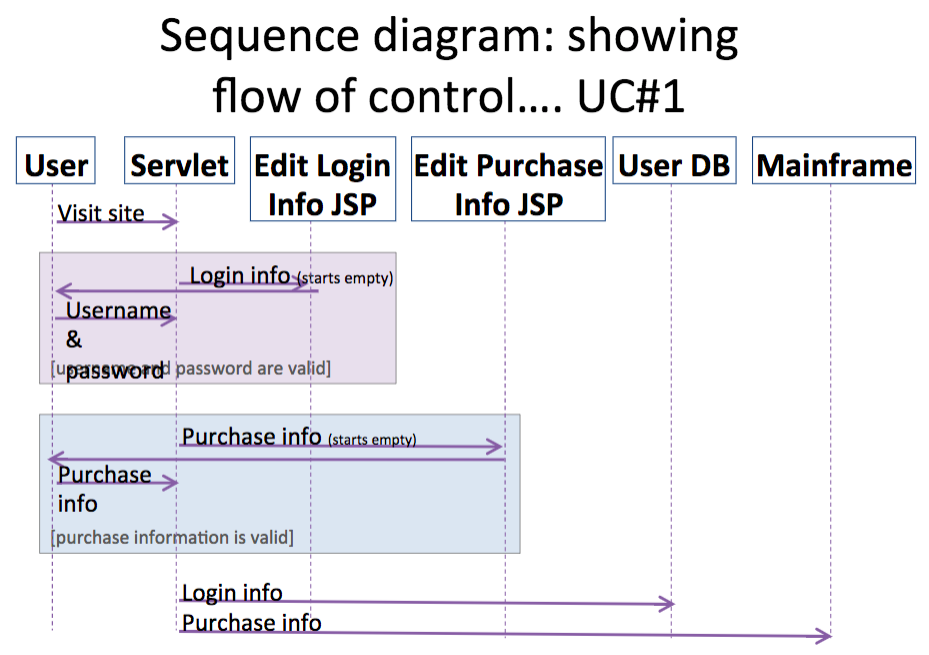
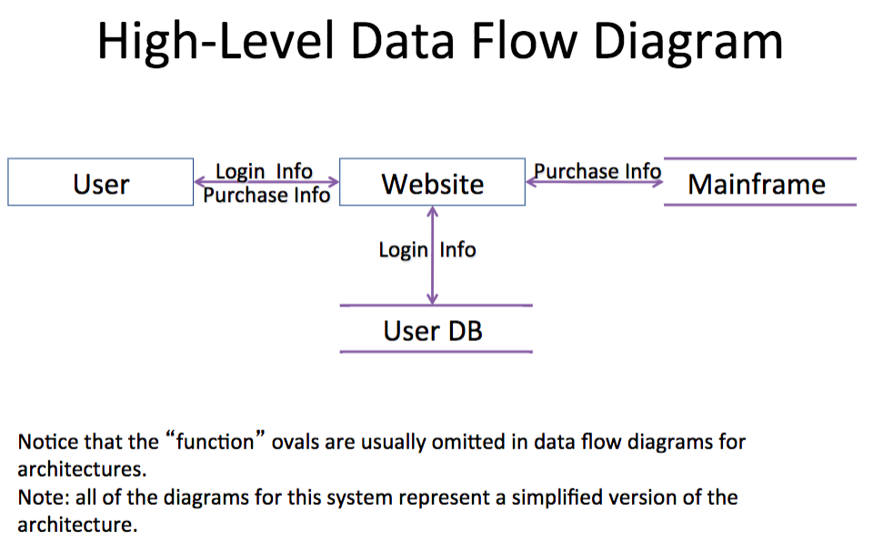
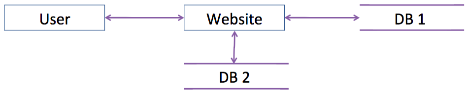
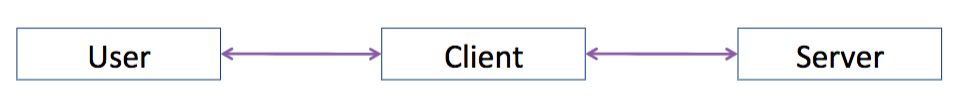
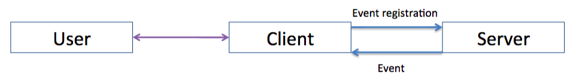
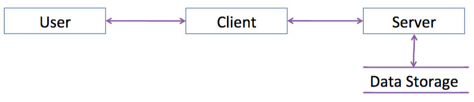
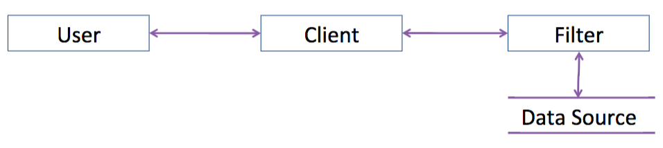
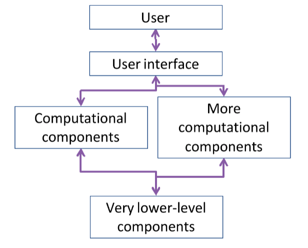

# 4.1 - Architecture Overview

## Architecture
* Architecture = show pieces of a system & their relationships
* Component = self-contained piece of a system, with clearly-defined interfaces
* Connector = a linkage between components via an interface

## Drawing Architecture
* All the usual diagramming notations apply
  * Dataflow diagrams
  * UML class & entity-relationship diagrams
  * Sequence & state diagrams
* ...but with strong emphasis on the *internals* of the system, rather than relationship to users

## UC#1: Sign-up
* Actor: user on internet
* Preconditions: user has credit card and browser
* Postconditions: login & purchase info stored
* Flow of events: User visits website
  * User fills out login info
  * User fills out purchase info
  * Website stores to mainframe

## Sequence diagram: showing flow of control.. UC#1
* 

## UC#2: Edit Purchase
* Actor: user on internet
* Preconditions: user has existing account
* Postconditions: updated purchase info stored
* Flow of events:
  * User logs into website
  * User updates purchase info
  * Website stores to mainframe

## High-Level Data Flow Diagram
* 

## Architectura Style
* Certain architectures occur over and over
  * Certain kinds of components & connectors
  * Ceratin typical arrangements
* Which web app is shown below?
* 

## Client-server
* Server = component that provides services
* Client = component that interacts with user and calls server
* Typical setup:
* 

## Peer-to-Peer
* Peer = component that provides services and may signal other peers

## Publish-Subscribe
* Publish = when a component advertises that it can send certain events
* Subscribe = when a component registers to receive certain events

## Typical Publish_subscribe Architecture
* 
* If we were doing a message sequence diagram (instead of a dataflow diagram), we'd show that event registration must happen before the event is fired. Remember how to do that?

## Repositories
* Classic repository is just a client-server design providing services for storing/accessing data
* Canvas repository is a publish-subscribe design: components wait for data to arrive on repository, then they compute and store more data

## Typical Repository Architecture
* 
* A blackboard architecture looks like a mashup of repository (shown above) and publish-subscribe (shown earlier).

## Pipe and Filter
* Filter = component that transforms data
* Pipe = connector that passes data between filters

## Typical Pipe and Filter Architecture
* 

## Layering 
* Layer = component that provides services to the next layer; components "hide" lower layers

## Typical Layer Architecture
* 

## Used a LOT!
* Software engineers draw these diagrams on a regular basis
* You will use them on your project

