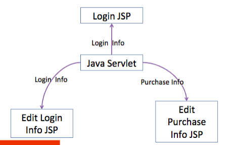
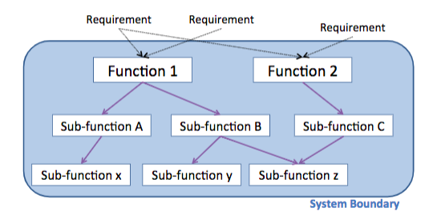

# 4.2 - Architecture Decomposition

## Decomposition: providing a detailed view of a component
* Decomposition of the "website" component
* Typical J2EE system: servlet passes data to JSP, which displays it; browser posts back to servlet
* 

## Approaches for decomposing an architecture
* Functional decomposition
* Data-oriented decomposition
* Object-oriented decomposition
* Process-oriented decomposition
* Feature-oriented decomposition
* Event-oriented decomposition

## Functional decomposition
* Breaks each requirement into functions, then breaks functions recursively into sub-functions
  * One component per function or sub-function
* Each **function computationally combines** the output of sub-functions 
  * e.g. ticket_price = fee(station_1) + fee(station_2) + distance_fee(staion1, station2) + fuel_surcharge(station1, station2) 

## Functional decomposition
* 

## Data-oriented decomposition
* Identofy data structures in requirements, break data structures down recursively 
  * One component per data structure
* Each data structure **contains part of the data**
  * e.g. Purchase info = Ticket info and billing info;
  * ticket info = two stations and a ticket type;
  * billing info = contact info and credit card info;
  * contact info = name, address, phone;
  * credit card info = type, number, expiration date;

## Data-oriented decomposition
* 

## Object-oriented decomposition
* Identify data structures aligned with functions in requirements, break down recursively 
  * One class component per data + function package
* Each component contains **part of the data+fn**s
  * OO decomposition essentially is the same as functional decomposition aligned with data decomposition

## Object-oriented decomposition
* 

## Process-oriented decomposition
* Break requirements into steps, break steps into sub-steps recursively 
  * One component per sub-step
* Each sub-step completes **one part of a task**
  * e.g. One component to authenticate the user, another to display purchase info for editing, another to store the results away

## Process-orientd decomposition
* 

## Feature-oriented decomposition
* Break each requirement into services, then break services into features
  * One component per service or feature
* Each feature **makes the service "a little better"**
  * e.g. service does basic authentication, but one feature gives it a user interface, another feature gives it an OpenID programmatic interface, another feature gives it input validation, and another feature does logging

## Feature-oriented decomposition
* 

## Event-oriented decomposition
* Break requirements into systems of events, recursively break into sub-events and state changes
  * Each component receives and sends certain events, and manages certain state changes
* Each component is like a **stateful agent**
  * e.g. in the larger ticketing system, the mainframe signals the ticket printing system and the credit card company; the ticket printer notifies mainframe when it mails ticket to user

## Event-oriented decomposition
* 

## Architectural style = a common kind of architecture
* Certain kinds of decomposition often occur 
  * Certain kinds of components & connectors 
* Example: which web app is shown below?
* 
  * It could be just about any web app... they all look pretty similar at this level of abstraction
* Mixing and matching is sometimes necessary
* 
* 
* 
* 
* 

