# Lecture 5.1 – Object-oriented Design Overview

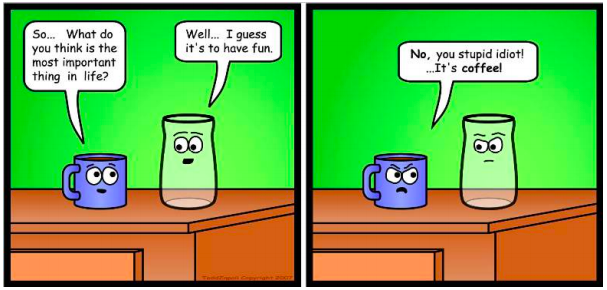

## Why is that joke supposed to be funny?
* Objects and concerns 
  * Objects have a concern in the sense that they have a *purpose*.
  * Which is not to say that inanimate objects are *concerned* in the sense of being *worried*

* Likewise, all code should have a **concern, a purpose for being.**
  * A place for every concern...
  * and every concern in its place

## Concerns of Classes
* Each *class* should have a clearly focused purpose.
  * One class usually corresponds to one kind of entity
  * Each class member usually corresponds to one attribute

* Only code related to that purpose should be in the class.
  * Put functions together with the daa that they modify.
  * Put code together if it needs to be modified at the same time.

## Concerns of packages
* Ditto for **packages**
  * Every package should have a purpose
  * Code should be in that package if and only if it is related to that purpose
* "Module" can refer to a class or to a package
  * Every module should have a purpose
  * Code should be in module if and only if related to that purpose

## An example system to support drug and alcohol counseling
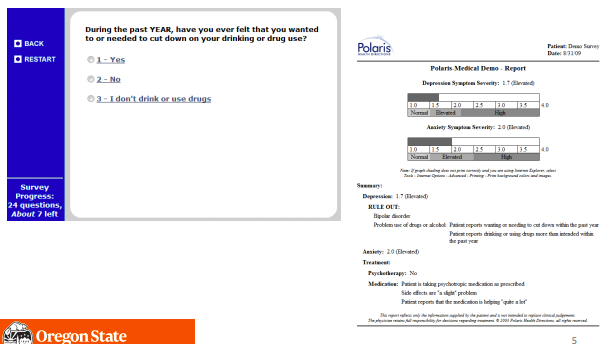

## What are the key concerns?
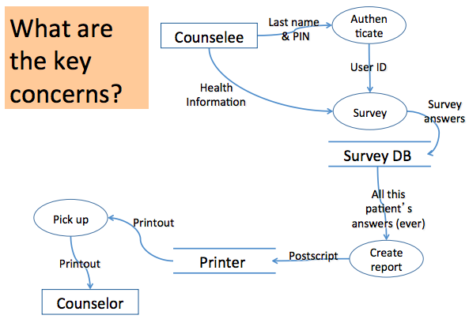

## Some key concerns
* Managing the users
  * Authenticating counselees
  * Matching counselees to counselors
* Performing the survey
  * Representing the questions
  * Representing the answers
  * Performing skip logic
  * Storing the answers
* Generating the report
  * Reading the data
  * Performing calculations in the report
  * Sending to the printer

## Coupling and Cohesion
* Coupling 
  * When one module is involved in another module's concern
* Cohesion
  * When a module is devoted to its concern

## Coupling Reduces Maintainability
* Levels of coupling
    * Content coupling (worst)
        * A modifies B    
    * Common coupling
        * A and B both read/write the same data
    * Control coupling
        * A calls B
    * Stamp coupling
        * A provides structured data to B
    * Data coupling
        * A provides unstructured data to B
    * Uncoupled (best)
        * None of the above

## Assigning concerns to code
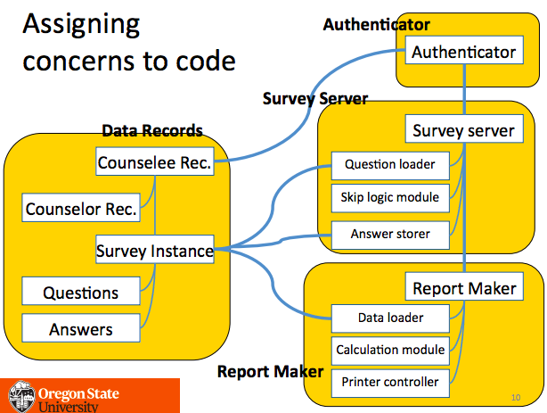

## Notes about UML class diagrams
* One box per kind of entity
  * Usually list attributes
  * Interfaces & abstract attributes
* Lines without arrowheads show references
  * Represent member variables in OO
  * Labeled with cardinality (multiplicity)
* Lines with open arrowheads for specialization
* Lines with regular arrowheads indicate dependencies

## How bad is inter-package coupling?
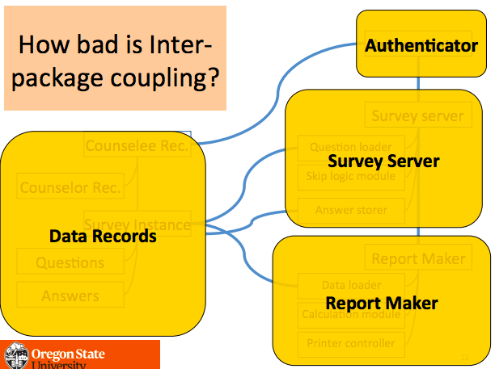

## Cohesion Increases Maintainability
* Levels of cohesion
    * Functional/informational cohesion (best)
        * A and B work together for just one purpose
    * Communicational cohesion
        * A and B use the same data
    * Procedural cohesion
        * A executes, then B executes, and A & B do not have any related purpose
    * Temporal cohesion
        * A executes, then B executes, but A & B do not have any related purpose
    * Logical cohesion
        * Either A or B might be executed
    * Coincidental cohesion (worst)
        * None of the above

## Intra-package cohesion
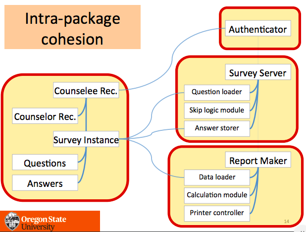

## Tip #1: Don't talk to strangers ("Law of Demeter")
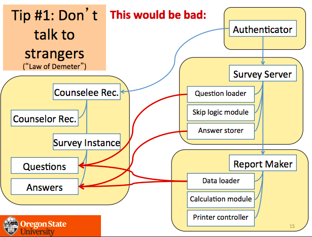

## Tip #2: Move code to where it's used 
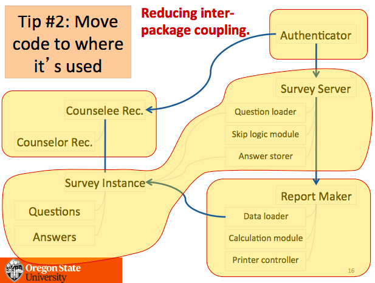

## Tip #3: Split modules to reduce cycles
* That design had no cycles 
  * But here's one way to get rid of cycles when they do happen to occur...
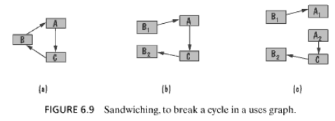

## Tip #4: In reuse, prefer composition over inheritance
* In general, **use composition to add features or to reuse code**, and use inheritance to add a new version of an entity.
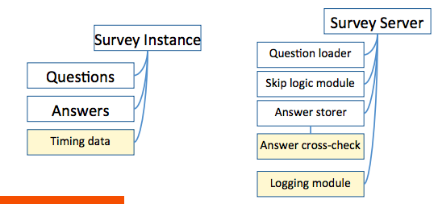

## Tip #4: In reuse, prefer composition over inheritance
* In general, use composition to add features or to reuse code, and **use inheritance to add a new version of an entity.**
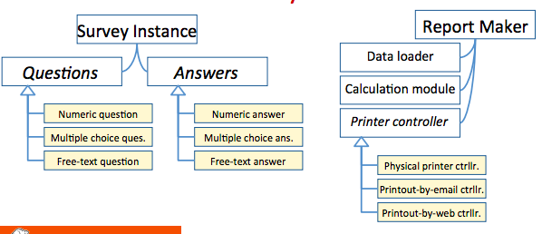

## The secret to Using Interfaces
* An interface is a promise
    * I can do this for you.
    * If you meet these preconditions, then I can meet these postconditions.
        * Functional or non-functional

* Polymorphism
    * If A and B and C and D each implement an interface, then they all make the same promise 
        * But may keep the promise in different ways!

## Incremental and Iterative Development
* Use incremental development
  * When much of the system's value resides in one subsection
  * When one part of the system msut be completed (logically) before another

* Use iterative development
  * When the system's value is spread out over much of the system
  * When the whole system needs to work at least a bit before you can build up

## Incremental and Iterative Development
* Incremental examples 
    * Adding new kinds of print outs
        * From customers' standpoint, paper printout carried much of the system's value
    * Adding new data export module
        * Logically, the main system needs to be done before we can worry about exporting data.

* Iterative examples
    * Tweaking reports and surveyor user interface to improve usability
        * Improvements to existing pieces of system
    * Adding new kinds of questions (and answers), changing reports accordingly
        * Changes are spread acress system

