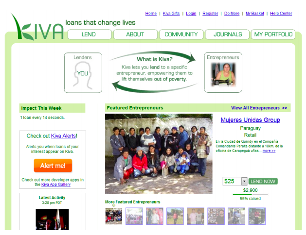
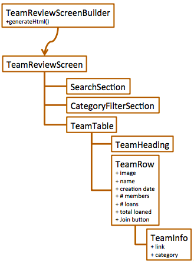
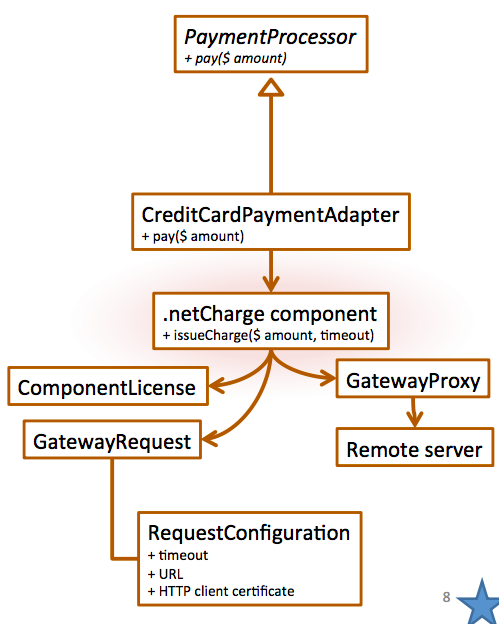
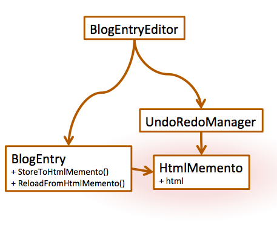
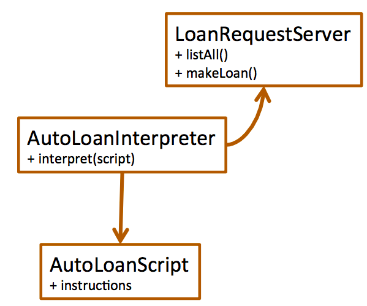
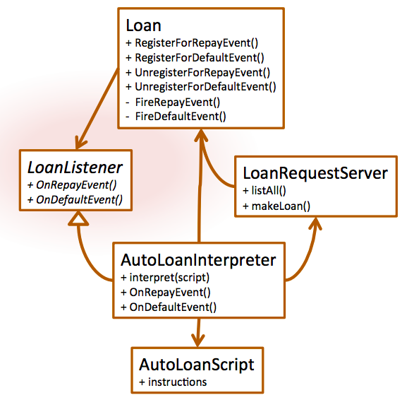

# Lecture 5.1 – Design Patterns I

## Patterns
* You need to hang a poster on the wall...
    * What do you do?

* You need to write a term paper...
    * How should it be organized?

## Design Patterns
* Design patterns (DPs) are...
    * Strategies for you "tollkit of ideas"
    * Template for solutions
    * Codified best practices
* Design patterns are not...
    * Architectural Styles (DPs are too low level)
    * Code libraries (DPs are ideas, not code)

## Design Patterns
* Primary goals of DPs
    * To help maintainability, flexibility, other quality attributes
    * To help system designers make good decisions
* There are a few dozen very common OO patterns
    * Patterns exist for other kinds of non-OO systems
    * Patterns are recognizable based on their structure and their purpose

## Example System
* Kiva system to connect lenders with borrowers
    * How could we use DPs to implement Kiva?
    * Howo could we use DPs to implement a better Kiva?

## Builder
* Knows how to create a complex object
* Use when instantiating an object requires filling it with parts or otherwise lengthy configuration

## Adapter
* Translates one interface to another by wrapping
* Use to overcome incompatibility

## Facade
* Object that provides a unified, high-level interface to subsystem
* Use when calling a subsystem requires a frequent series of complex lines of code

## Memento
* Encapsulates state in an object
* Use if you might want to return to a certain state later

## Interpreter 
* Parses and acts on instructions written in a certain syntax
* Use to add scriptability

## Observer
* Watching for another object to change state
* Maintains a list of observers and notifies them
* Use in any event-driven design

## Which patter would you use?
* You are building a cool #D game. Your company licenses a big, ugly library that implements the 3D mathematics.
    * Interpreter
* Your application might crash at anytime. You want your application to save its state so that if it crashes, then it can auto-recover.
    * Observer, memento
* Your applicationn should run after any student uploads a homework to Blackboard.
    * Observer, memento
* Your application needs to generate PDF files (from scratch)
    * Builder
* You want to let users create and run macros inside your application
    * Facade
* Your company already implemented a component that *almost* implements the interface that you need, but *not quite*
    * Adapter
* You have a component that needs to implement three very slightly different interfaces
    * Builder
* Your program has to create some big, ugly record objects before inserting them into a database
    * Interpreter
* Your program has to support replication. You need a way for the program to save its state so the program can be copied to other servers
    * Memento
* Your program generates various outputs. You need a way to notify Facebook users when certain outputs are generated
    * Observer
* Sending a message to Facebook requires lots of big, ugly code.
    * Interpreter, adapter

## For more information...
* Your textbook discusses seven other patterns, which will be discussed in the next class
    * Template method
    * Factory method
    * Strategy
    * Decorator
    * Observer
    * Composite
    * Visitor

## If you have questions...
* The textbook discussed a few DPs in detail
* Wikipedia has good articles on all 23 primary DPs
* Email me
* I can set up a class discussion for DPs
* There are many books and articles on DPs

