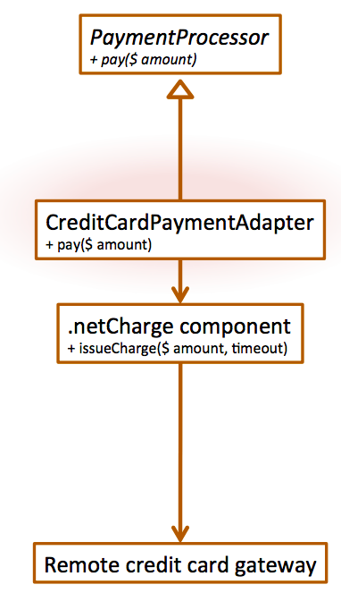

# Lecture 5.1 – Design Patterns I

## Patterns
* You need to hang a poster on the wall...
    * What do you do?

* You need to write a term paper...
    * How should it be organized?

## Design Patterns
* Design patterns (DPs) are...
    * Strategies for you "tollkit of ideas"
    * Template for solutions
    * Codified best practices
* Design patterns are not...
    * Architectural Styles (DPs are too low level)
    * Code libraries (DPs are ideas, not code)

## Design Patterns
* Primary goals of DPs
    * To help maintainability, flexibility, other quality attributes
    * To help system designers make good decisions
* There are a few dozen very common OO patterns
    * Patterns exist for other kinds of non-OO systems
    * Patterns are recognizable based on their structure and their purpose

## Example System
* Kiva system to connect lenders with borrowers
    * How could we use DPs to implement Kiva?
    * Howo could we use DPs to implement a better Kiva?

## Builder
* Knows how to create a complex object
* Use when instantiating an object requires filling it with parts or otherwise lengthy configuration

## Adapter
* Translates one interface to another by wrapping
* Use to overcome incompatibility

## Facade
* Object that provides a unified, high-level interface to subsystem
* Use when calling a subsystem requires a frequent series of complex lines of code

## Memento
* Encapsulates state in an object
* Use if you might want to return to a certain state later

