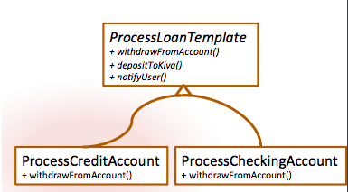
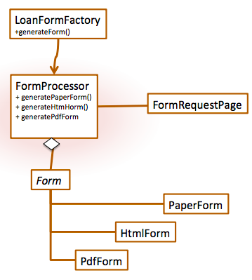
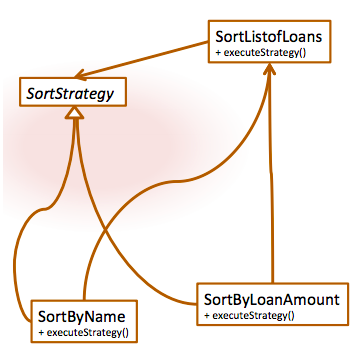
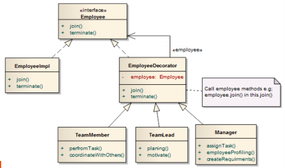
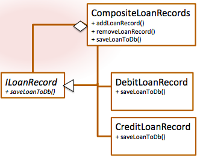

# Lecture 5.3 – Design Patterns II

## Template method
* Breaks an algorithm into steps
* Children inherit and override any step they need to change
* Useful if a general algorithm can be modified slightly and be reused

## Factory method
* Define an interface for creating an object, but let the classes that implement the interface decide which class to instantiate. The factory method lets a class defer instantiation to subclasses.

## Strategy 
* Allows for the selection of algorithm at runtime

## Decorator
* Useful for assigning behavior at runtime independently of other instances of the same class.
* Allows multiple decorations per class.

## Composite
* Allows for the reduction of complexity by dealing with a group of objects as a single object

## Visitor
* Allows for a separation of the algorithm and the data it works on 
* Built on method overloading and dynamic types

* Basic idea:
    * An element has an accept() method that can take the visitor as an argument
    * The accpet() method calls a visit() method of the visitor.
    * The element passes itself as an argument to the visit() method.
    * Depending on the types of the element and visitor at runtime, and the proper algorithm excutes
    * See Wikipedia for more details.

## Which pattern woudl you use?
* Your system needs to be able to dynamically process payment according to what country the payment is coming from. 
* You'd like to build your model such that the data and algorithms running over the data are kept separate
* Your system needs to executre the same algorithm over multiple data sources of the same type.
* You have three algorithms that only differ slightly.
* You'd like to extend the functionality of a credit card rocessor to allow for customers to change their credit card at runtime.
* Your system neds to issue unique membership cards to your customers. You have both elite and regular customer types.
